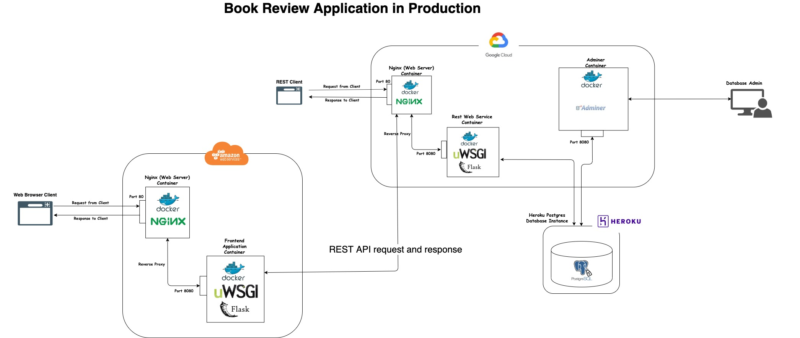

# Book Review Management System
The goal of this application is to allow book readers connect with the world by letting other readers know how they feel about the books that they read.

Currently our database only has about 5000 books. There are plans to add additional book data.

## Want to try our app? [click here](http://ec2-18-218-59-12.us-east-2.compute.amazonaws.com/)

## Technologies Used:
1. Docker
2. Docker-compose
3. Nginx
4. Postgres
5. uWSGI
6. Swagger

## Our production application infrastructure

## Using our Application
### Unauthorized User HomePage

### Registration Page

### Login Page

### Authorized User HomePage

### Authorized User HomePage

### LookUp Book

### Found Book

### Add review on a book

### View Reviews on Book

### View Your Reviews
